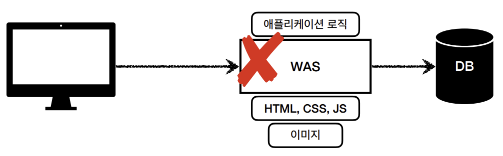

# 2주차

날짜: 2022년 5월 21일

## 스프링 MVC 1편 - 백엔드 웹 개발 핵심 기술

### 웹 서버(Web Server)

- HTTP 기반으로 동작
- 정적 리소스 제공, 기타 부가 기능
- 정적(파일) HTML, CSS, JS, 이미지, 영상
- 예) NGINX, APACHE

### 웹 애플리케이션 서버(WAS - Web Application Server)

- HTTP 기반으로 동작
- 웹 서버 기능 포함
- 프로그램 코드를 실행해서 애플리케이션 로직 수행
    - 동적 HTML, HTTP API(JSON)
    - 서블릿, JSP, 스프링 MVC
- 예) Tomcat, jetty,

### 웹 서버, 웹 애플리케이션 서버 차이

- 웹 서버는 정적 리소스, WAS는 애플리케이션 로직
- 사실은 둘의 용어도 경계도 모호함
    - 웹 서버도 프로그램을 실행하는 기능을 포함하기도 함
    - 웹 애플리케이션 서버도 웹 서버의 기능을 제공함
- 자바는 서블릿 컨테이너 기능을 제공하면 WAS
- WAS는 애플리케이션 코드를 실행하는데 더 특화

### 웹 시스템 구성 - WAS, DB

- WAS, DB 만으로 시스템 구성 가능
- WAS는 정적 리소스, 애플리케이션 로직 모두 제공 가능



- WAS가 너무 많은 역할을 담당, 서버 과부하 우려
- WAS 장애 시 오류 화면도 노출 불가능

### 웹 시스템 구성 - WEB, WAS, DB

- 정적 리소스는 웹 서버가 처리
- 웹 서버는 애플리케이션 로직 같은 동적인 처리가 필요하면 WAS에 요청을 위함
- WAS는 중요한 애플리케이션 로직 처리 담당
- 효율적인 리소스 관리
    - 정적 리소스가 많이 사용되면 Web 서버 증설
    - 애플리케이션 리소스가 많이 사용되면 WAS 증설
- 정적 리소스만 제공하면 웹 서버는 잘 죽지 않음
    - 애플리케이션 로직이 동작하는 WAS 서버는 잘 죽음
    - WAS, DB 장애 시 WEB 서버가 오류 화면 제공 가능


### 서블릿


- 실제 비지니스 로직을 처리하기 전에 HTTP 코드 파싱 등 전과 후의 공통된 행위가 너무 많음
- 서블릿 사용 시 비지니스 로직만 처리하면 나머지는 알아서 처리해줌
- urlPatterns의 URL이 호풀되면 서블릿 코드가 실행
- HTTP 요청 정보를 편리하게 사용할 수 있는 HttpServletRequest
- HTTP 응답 정보를 편리하게 제공할 수 있는 HTTpServletResponse
- 개발자는 HTTP 스펙을 매우 편리하게 사용

### 서블릿 HTTP 요청, 응답 흐름


### 서블릿 컨테이너

- 톰캣 처럼 서블릿을 지원하는 WAS를 서블릿 컨테이너라고 함
- 서블릿 컨테이너는 서블릿 객체를 생성, 초기화, 호출, 종료하는 생명주기 관려
- 서블릿 객체는 싱글톤으로 관리
    - 고객의 요청이 올 때 마다 계속 객체를 생성하는 것은 비효율
    - 최초 로딩 시점에 서블릿 객체를 미리 만들어두고 재활용
    - 모든 고객 요청은 동일한 서블릿 객체 인스턴스에 접근
    - **공유 변수 사용 주의**
    - 서블릿 컨테이너 종료 시 함계 종료
- JSP도 서블릿으로 변환 되어서 사용
- 동시 요청을 위한 멀티 쓰레드 처리 지원

### 쓰레드

- 애플리케이션 코드를 하나하나 순차적으로 실행하는 것은 쓰레드
- 자바 메인 메서드를 처음 실행하면 main이라는 이름의 쓰레드가 실행
- 쓰레드가 없다면 자바 애플리케이션 실행이 불가능
- 쓰레드는 한번에 하나의 코드 라인만 수행
- 동시 처리가 필요하면 쓰레드를 추가로 생성
- 요청 마다 쓰레드 생성
    - 장점
        - 동시 요청을 처리할 수 있다
        - 하나의 쓰레드가 지연 되어도, 나머지 쓰레드는 정상 동작한다.
    - 단점
        - 쓰레드는 생성 비용이 매우 비싸다.
            - 요청이 올 때 마다 쓰레드를 생성하면 응답 속도가 늦어진다.
        - 쓰레드는 컨텍스트 스위칭 비용이 발생한다.
        - 쓰레드 생성에 제한이 없다.
            - 고객 요청이 너무 많이 오면 CPU, 메모리 임계점을 넘어서 서버가 죽을 수 있다.

### 쓰레드 풀

요청 마다 쓰레드 생성의 단점 보안


- 필요한 쓰레드를 쓰레드 풀에 보관하고 관리한다.
- 쓰레드 풀에 생성 가능한 쓰레드의 최대치를 관리하다. 톰캣은 최대 200개 기본 설정(변경 가능)
- 쓰레드가 필요하면, 이미 생성되어 있는 쓰레드를 쓰레드 풀에서 꺼내서 사용한다.
- 사용을 종료하면 쓰레드 풀에 해당 쓰레드를 반납한다.
- 최대 쓰레드가 모두 사용 중이어서 쓰레드 풀에 쓰레드가 없으면?
    - 기다리는 요청은 거절하거나 특정 숫자 만큼만 대기하도록 설정할 수 있다.
- 장점
    - 쓰레드가 미리 생성되어 있으므로, 쓰레드를 생성하고 종료하는 비용이 절약되고, 응답 시간이 빠르다.
    - 생성 가능한 쓰레드의 최대치가 있으므로 너무 많은 요청이 들어와도 기존 요청은 안전하게 처리할 수 있다.

### 쓰레드 풀 실무 팁

- WAS의 주요 튜닝 포인트는 최대 쓰레드(max thread) 수이다.
- 이 값을 너무 낮게 설정하면?
    - 동시 요청이 많으면, 서버 리소스는 여유롭지만, 클라이언트는 금방 응답 지연
    
    
    
- 이 값을 너무 높게 설정하면?
    - 동시 요청이 많으면, CPU, 메모리 리소스 임계점 초과로 서버 다운
- 장애 발생 시?
    - 클라우드면 일단 서버부터 늘리고, 이후에 튜닝
    - 클라우드가 아니면 열심히 튜닝
- 쓰레드 풀의 적정 숫자
    - 애플리케이션 로직의 복잡도, CPU, 메모리, IO리소스 상황에 따라 모두 다름
    - 성능 테스트
        - 최대한 실제 서비스와 유사하게 성능 테스트 시도
            - 툴 : 아파치 ab, 제이미터, nGrinder

### WAS의 멀티 쓰레드 지원

- 멀티 쓰레드에 대한 부분은 WAS가 처리
- **개발자가 멀티 쓰레드 과련 코드를 신경쓰지 않아도 됨**
- 개발자는 마치 **싱글 쓰레드 프로그래밍을 하듯이 편리하게 소스 코드를 개발**
- 멀티 쓰레드 환경이므로 싱글톤 객체(서블릿, 스프링 빈)는 주의해서 사용

### 정적 리소스

- 고정된 HTML 파일, CSS, JS, 이미지, 영상 등을 제공
- 주로 웹 브라우저

### HTTP API

- HTML이 아니라 데이터를전달
- 주로 JSON 형식 사용
- 다양한 시스템에서 호출
- 데이터만 주고 받음, UI 화면이 필요하면 클라이언트가 별도 처리
- 앱, 웹 클라이언트, 서버 to 서버


### 서버 사이드 렌더링, 클라이언트 사이드 렌더링

- SSR - 서버 사이드 렌더링
    - HTML 최종 결과를 서버에서 만들어서 웹 브라우저에 전달
    - 주로 정적인 화면에 사용
    - 관련기술 : JSP, 타임리프 → 백엔드 개발자
- CSR - 클라이언트 사이드 렌더링
    - HTML 결과를 자바스크립트를 사용해 웹 브라우저에서 동적으로 생성해서 적용
    - 주로 동적인 화면에 사용 웹 환경을 마치 앱 처럼 필요한 부분부분 변경할 수 있음
    - 예) 구글 지도, Gmail, 구글 캘린더
    - 관련기술 : React, Vue.js → 웹 프론트엔드 개발자
- 참고
    - React, Vue.js를 CSR + SSR 동시에 지원하는 웹 프레임워크도 있음
    - SSR을 사용하더라도, 자바스크립트를 사용해서 화면 일부를 동적으로 변경 가능
    

### 어디까지 알아야 하나요?

**백엔드 개발자 입장에서 UI 기술**

- **백엔드 - 서버 사이드 렌더링 기술**
    - JSP, 타임리프
    - 화면이 정적이고, 복잡하지 않을 때 사용
    - 백엔드 개발자는 서버 사이드 렌더링 기술 학습 필수
- **웹 프론트엔드 - 클라이언트 사용드 렌더링 기술**
    - React, Vue.js
    - 복잡하고 동적인 UI 사용
    - 웹 프론트엔드 개발자의 전문 분야
- 선택과 집중
    - 백엔드 개발자의 웹 프론트엔드 기술 학습은 **옵션**
    - 백엔드 개발자는 서버, DB, 인프라 등등 수 많은 백엔드 기술을 공부해야 한다.
    - 웹 프론트엔드도 깊이 있게 잘 하려면 숙련에 오랜 시간이 필요하다.
    

### 자바 웹 기술 역사

- 서블릿 - 1997
    - HTML 생성이 어려움
- JSP - 1999
    - HTML 생성은 편리하지만, 비즈니스 로직 까지 너무 많은 역할 담당
- 서블릿, JSP 조합 MVC 패턴 사용
    - 모델, 뷰 컨트롤러로 역할을 나누어 개발
- MVC 프레임워크 춘추 전국 시대 - 2000년 초 ~ 2010년 초
    - MVC 패턴 자동화, 복잡한 웹 기술을 편리하게 사용할 수 있는 다양한 기능 지원
    - 스트럿츠, 웹워크, 스프링 MVC(과거 버전)
- 애노테이션 기반의 스프링 MVC 등장
    - @Controller
    - MVC 프레임워크 춘추 전국 시대 마무리
- 스프링 부트의 등장
    - 스프링 부트는 서버를 내장
    - 과거에는 서버에 WAS를 직접 설치하고, 소스는 War 파일을 만들어서 설치한 WAS에 배포
    - 스프링 부트는 빌드 결과(Jar)에 WAS 서버 포함 → 빌드 배포 단순화
- 스프링 웹 기술의 분화
    - Web Servlet - Spring MVC
    - Web Reactive - Spring WebFlux

### Spring WebFlux

- 비동기 넌 블러킹 처리
- 최소 쓰레드로 최대 성능 - 쓰레드 컨텍스트 스위칭 비용 효율화
- 함수형 스타일로 개발 - 동시 처리 코드 효율화
- 서블릿 기술 사용 X
- 단점
    - 웹 플럭스는 기술적 난이도 매우 높음
    - 아직은 RDB 지원 부족
    - 일반 MVC의 쓰레드 모델도 충분히 빠르다.
    - 실무에서 아직 많이 사용하지는 않음 (전체 1% 이하)

### 자바 뷰 템플릿 역사

**HTML을 편리하게 생성하는 뷰 기능**

- JSP
    - 속도 느림, 기능 부족
- 프리마커(Freemarker), 벨로시티(Velocity)
    - 속도 문제 해결, 다양한 기능
- 타임리프(Thymeleaf)
    - 내추럴 템플릿 : HTML의 모양을 유지하면서 뷰 템플릿 적용 가능
    - 스프링 MVC와 강력한 기능 통합
    - 최선의 선택, 단 성능은 프리마커, 벨로시티가 더 빠름

### 서블릿

- @WebServlet 서블릿 애노테이션
    - name : 서블릿 이름
    - urlPatterns: URL 매핑
- HTTP 요청을 통해 매핑 된 URL이 호출되면 서블릿 컨테이너는 다음 메서드를 실행한다
    - `protected void service(HttpServletRequest request, HttpServletResponse response)`
- 요청 해더 정보 로그에 남기기
    - [application.properties](http://application.properties) 파일
    - `logging.level.org.apache.coyote.http11=debug`


### HttpServletRequest - 개요

- HTTP 요청 메시지를 편리하게 사용할 수 있도록 개발자 대신에 HTTP 요청 메시지를 파싱
- 결과를 HttpServletReqeust 객체에 담아서 제공한다.
- HTTP 요청 메시지

```java
POST /save HTTP/1.1
Host: localhost:8080
Content-Type: application/x-www-form-urlencoded

username=kim&age=20
```

- 임시 저장소 기능
    - 해당 HTTP 요청이 시작부터 끝날 때 까지 유지되는 임시 저장소 기능
    - 저장: `request.setAttribute(name, value)`
    조회: `request.getAttribute(name)`
- 세션 관리 기능
    - `request.getSession(create: true)`

> **중요**
HttpServletRequest, HttpServletResponse를 사용할 때 가장 중요한 점은 이 객체들이 HTTP 요청
메시지, HTTP 응답 메시지를 편리하게 사용하도록 도와주는 객체라는 점이다. 따라서 이 기능에 대해서
깊이있는 이해를 하려면 HTTP 스펙이 제공하는 요청, 응답 메시지 자체를 이해해야 한다.
> 

### HTTP 요청 데이터 - 개요

주로 3가지 방법을 사용한다.

- GET - 쿼리 파라미터
    - `/url?username=hello&age=20`
    - 메시지 바디 없이, URL의 쿼리 파라미터에 데이터를 포함해서 전달
    - 예) 검색, 필터, 페이징 등에서 많이 사용하는 방식
- POST - HTML Form
    - `content-type: application/x-www-form-urlencoded`
    - 미시지 바디에 쿼리 파라미터 형식으로 전달 `username=hello&age=20`
    - 예) 회원가입, 상품 주문, HTML Form 사용
    - `application/x-www-form-urlencoded` 형식은 앞서 GET에서 살펴본 쿼리 파라미터 형식과 같다.
    따라서 쿼리 파라미터 조회 메서드를 그대로 사용하면 된다.
    - postman으로 간단히 테스트 가능
- HTTP message body에 데이터를 직접 담아서 요청
    - HTTP API 에서 주로 사용, JSON, XML, TEXT
    - 데이터 형식은 주로 JSON 사용
    - POST, PUT, PATCH

### HttpServletResponse - 기본 사용법

- 역활
    - HTTP 응답 코드 지정
    - 헤더 생성
    - 바디 생성
- 편의 기능 제공
    - Content-Type
    - 쿠키
    - Redirect

### HTTP 응답 데이터 - 단순 텍스트, HTML

HTTP 응답 메시지는 주로 다음 내용을 담아서 전달한다.

- 단순 텍스트 응답
    - 앞에서 살펴봄`writer.print(”ok”);`
- HTML 응답
- HTTP API - MessageBody JSON 응답

### 서블릿으로 회원 관리 웹 애플리케이션 만들기

서블릿과 자바 코드만으로 HTML을 만들었다. 서블릿 덕분에 동적으로 원하는 HTML을 마음껏 만들 수 있다.

하지만 자바 코드로 HTML을 만들어 내는 것은 매우 불편함

차라리 HTML 문서에 동적으로 변경해야 하는 부분만 자바 코드를 넣을 수 있다면 더 편리할 것이다.

이것을 템플릿 엔진이라 함

템플릿 엔진은 JSP, Thymeleaf, Freemarker 등이 있다.

### JSP로 회원 관리 웹 애플리케이션 만들기

- webapp/jsp 밑에 파일 넣어야함
- `<%@ page contentType="text/html;charset=UTF-8" language="java" %>` 선언
- 실행 시 .jsp까지 넣어줘야함
- <%   %>안에 자바 코드 입력 가능
- `<%@ **page** import="hello.servlet.domain.member.MemberRepository" %>` 입력 시 Import 기능

### 서블릿과 JSP의 한계

- 서블릿으로 개발할 때는 뷰 화면을 위한 HTML을 만드는 작업이 자바 코드에 섞여서 복잡함
    - JSP를 사용한 덕분에 뷰를 생성하는 HTML 작업을 깔끔하게 가저감.
- 하지만 JSP에 자바 코드가 노출 됨.
    - JSP가 너무 많은 역할을 한다.

### MVC 패턴 - 개요

- 너무 많은 역할
    - 하나의 서블릿이나 JSP만으로 비즈니스 로직과 뷰 렌더링까지 모두 처리하게 되면 너무 많은 역할을 하게 됨
        - 유지보수가 어려워짐
    - UI변경을 해야 할 때도 비즈니스 로직이 함께 있는 파일을 수정해야 함
- 변경의 라이프 사이클
    - 변경 주기가 다르다면 분리해야 함
- 기능 특화
    - JSP 같은 뷰 템플릿은 화면을 렌더링 하는데 최적화 되어 있음
    - 이 부분의 업무만 담당하는 것이 가장 효과적
- Model View Controller
    - 컨트롤러 : HTTP 요청을 받아서 파라미터를 검증하고 비즈니스 로직을 실행한다. 그리고 뷰에 전달할 결과 데이터를 조회해서 모델에 담는다
    - 모델 : 뷰에 출력할 데이터를 담아둔다. 뷰가 필요한 데이터를 모두 모델에 담아서 전달해주는 덕분에 뷰는 비즈니스 로직이나 데이터 접근을 몰라도 되고, 화면을 렌더링 하는 일에 집중할 수 있다.
    - 뷰 : 모델에 담겨있는 데이터를 사용해서 화면을 그리는 일에 집중한다. 여기서는 HTML을 생성하는 부분을 말한다.
    
    > **참고**
    컨트롤러에 비즈니스 록직을 둘 수도 있지만, 이렇게 되면 컨트롤러가 너무 많은 역활을 담당한다. 그래서 일반적으로 비즈니스 로직은 서비스(Service)라는 계층을 별로로 만들어 처리한다.
    > 
    

### MVC 패턴 - 적용

- `dispatcher.forward()` : 다른 서블릿이나 jsp로 이동할 수 있는 기능이다 서버 내부에서 작동하므로 클라이언트에서 알아채지 못한다.
- /WEB-INF : 요기 안에 넣으면 외부에서 직접 jsp를 호출할 수 없다

### MVC 패턴 - 한계

- 포워드 중복
    - View로 이동하는 코드가 항상 중복 호출되어야 한다.
- ViewPath 중복
    - prefix :`/WEB-INF/views/`
    - suffix : `.jsp`
    - 만약 jsp가 아닌 타입리프로 변경 시 전체 코드를 다 변경해야 한다.
- 사용하지 않는 코드
    - HttpServletResponse는 아에 사용되지 않는다
- 공통 처리가 어렵다
    - 기능이 복잡해 질수록 컨트롤러에서 공통으로 처리해야 하는 부분이 늘어남
    - 공통 기능을 메서드로 뽑아도 되지만 항상 해당 메서드를 호출해야 함

<aside>
💡 정리하자면, 공통 처리가 어렵다는 문제가 있다.
이 문제를 해결하려면 컨트롤러 호출 전에 먼저 공통 기능을 처리해야 한다. 소위 수문장 역할을 하는 기능이 필요하다.
프론트 컨트롤러 패턴을 도입하면 이런 문제를 깔끔하게 해결할 수 있다. (입구를 하나로!)

</aside>

### 프론트 컨트롤러

- 프론트 컨트롤러 도입 전


- 프론트 컨트롤러 도입 후


- 특징
    - 프론트 컨트롤러 서블릿 하나로 클라이언트의 요청을 받음
    - 프론트 컨트롤러가 요청에 맞는 컨트롤러를 찾아서 호풀
    - 공통 처리 가능
    - 프론터 컨트롤러를 제외한 나머지 컨트롤러는 서블릿을 사용하지 않아도 됨
    

### 프론트 컨트롤러 제작

- V1 : 프론트 컨트롤러 제작
    - 특정 URI 하위의 모든 경로는 프론트 컨트롤러 호출
    - 각 화면의 공통 부모인 인터페이스 생성
    - 프론트 컨트롤러에서 받은 uri에 따라 인터페이스를 상속 받은 컨트롤러 호출
- V2 : 컨트롤러 공통 기능 처리
    - 마지막에 랜더링 `dispatcher.forward(request, response);` 하는 부분을 공통 처리
- V3 : 서블릿 종속성 제거, 뷰 이름 중복 제거
    - ModelView 추가로 인한 MyView 서블릿 종속성 제거
    - viewResolver 추가로 인한 논리 뷰 이름을 실제 물리 뷰 경로로 변경
- V4 : 개발자 편의성 개선
    - Controller로 넘겨줄 때 ModelView의 model을 FrontController에서 직접 생성
        - 결과적으로 직접 뷰의 논리 이름을 반환
- V5 : 위의 어떤 컨트롤러도 호출 가능한 유연한 컨트롤러
    - 핸들러 어뎁터 추가로 해당 컨트롤러의 어뎁터를 찾아 처리
    

### 스프링 MVC

스프링 MVC에는 위에서 학습한 프론트 컨트롤러의 기능을 모두 가지고 있다. 컨트롤러와 핸들러, 어노테이션을 처리하는 핸들러 어뎁터를 도입하여 OCP를 지키며 확장성 있게 개발되었다.

### 스프링 MVC의 구조


- 동작 순서
    1. 핸들러 조회
    2. 핸들러 어뎁터 조회
    3. 핸들러 어댑터 실행
    4. 핸들러 실행
    5. ModelAndView 반환
    6. viewResolver 호풀
    7. View 반환
    8. 뷰 렌더링

### DispacherServlet

- 스프링의 FrontController이 DIspacherServlet
- 스프링 부트는 DispacherServlet을 서블릿으로 자동 등록 및 모든 경로에 대해 매핑

### 핸들러 매핑과 핸들러 어댑터

- HandlerMapping(핸들러 매핑)
    - 핸들러 매핑에서 이 컨트롤러를 찾을 수 있어야 한다.
    - 예) 스프링 빈의 이름으로 핸들러를 찾을 수 있는 핸들러 매핑이 필요하다.
    HandlerAdapter(핸들러 어댑터)
- 핸들러 매핑을 통해서 찾은 핸들러를 실행할 수 있는 핸들러 어댑터가 필요하다.
    - 예) Controller 인터페이스를 실행할 수 있는 핸들러 어댑터를 찾고 실행해야 한다.

스프링은 이미 필요한 핸들러 매핑과 핸들러 어댑터를 대부분 구현해두었다. 개발자가 직접 핸들러 매핑과 핸들러 어댑터를 만드는 일은 거의 없다.

- **스프링 부트가 자동 등록하는 핸들러 매핑과 핸들러 어댑터**
(실제로는 더 많지만, 중요한 부분 위주로 설명하기 위해 일부 생략)
    - HandlerMapping
        
        <aside>
        💡 0 = RequestMappingHandlerMapping : 애노테이션 기반의 컨트롤러인 @RequestMapping에서 사용
        1 = BeanNameUrlHandlerMapping : 스프링 빈의 이름으로 핸들러를 찾는다.
        
        </aside>
        
    - HandlerAdapter
        
        <aside>
        💡 0 = RequestMappingHandlerAdapter : 애노테이션 기반의 컨트롤러인 @RequestMapping에서 사용
        1 = HttpRequestHandlerAdapter : HttpRequestHandler 처리
        2 = SimpleControllerHandlerAdapter : Controller 인터페이스(애노테이션X, 과거에 사용) 처리
        
        </aside>
        
    - 핸들러 매핑도, 핸들러 어댑터도 모두 순서대로 찾고 만약 없으면 다음 순서로 넘어간다.

### @RequestMapping

- 가장 우선순위가 높은 핸들러 매핑과 핸들러 어댑터는 `RequestMappingHandlerMapping`, `RequestMappingHandlerAdapter` 이다
- `@RequestMapping`의 앞 글자를 따서 만든 이름.
- 99% 이 방식 사용.

### ViewResolver

- InternalResourceViewResolver
    - `application.properties`에 등록한 `spring.mvc.view.prefix`, `spring.mvc.view.suffix` 정보를 사용해서 등록
- 스프링 부트가 자동 등록하는 뷰 리졸버
(실제로는 더 많지만, 중요한 부분 위주로 설명하기 위해 일부 생략)
    
    <aside>
    💡 1 = BeanNameViewResolver : 빈 이름으로 뷰를 찾아서 반환한다. (예: 엑셀 파일 생성
    기능에 사용)
    2 = InternalResourceViewResolver : JSP를 처리할 수 있는 뷰를 반환한다.
    
    </aside>
    

### 스프링 MVC - 시작하기

스프링이 제공하는 컨트롤러는 애노테이션 기반으로 동작해서 매우 유연하고 실용적이다.

- `@Controller` : 스프링이 자동으로 스프링 빈으로 등록한다.
    - 내부에 `@Component` 애노테이션이 있어서 컴포넌트 스캔의 대상이 됨
    - 스프링 MVC에서 애노테이션 기반 컨트롤러로 인식한다.
- `@RequestMapping` : 요청 정보를 매핑한다. 해당 URL이 호출 되면 이 메서드가 호출된다.
- `ModelAndView`에 매핑 URL을 넣어 반환함

### 스프링 MVC - 실용적인 방식

- Model 파라미터
    - Model을 파라미터로 받는 것이 가능. `addAttribute()`로 추가 가능
- ViewName 직접 반환
    - 뷰의 논리 이름을 반환할 수 있다.
    - ModelAndView로 반환하지 않아도 된다.
- `@RequestMapping` 사용
    - Spring은 HTTP 요청 파라미터를 `@RequestMapping`으로 받을 수 있다.
    - `@ReqeustParam("username")`은 `request.getParameter("username")`과 동일하다.
- @`RequestMapping` → `@GetMapping`, `@PostMapping`
    - GET Method만 처리하고 싶을 때
        - `@RequestMapping(value = "/new-form", method = RequestMethod.GET)`
    - `@GetMapping("/new-form")` 으로 변경 가능

### 스프링 MVC - 구조 이해

- Welcome Page
    - 스프링 부트에 `Jar` 를 사용하면 `/resources/static/index.hml` 위치에 `index.html` 파일을 두면 Welcome 페이지로 처리해준다. (스프링 부트가 지원하는 정적 컨텐츠 위치에 `/index.html` 이 있으면 된다.)

### 로깅

- 로그 라이브러리는 Logback, Log4J, Log4J2 등 아주 많음
    - SLF4J는 로그 라이브러리의 인터페이스
    - 스트링 부트는 Logback을 사용

<aside>
💡 `@RestController`
`@Controller` + `@ResponseBody` 합친 어노태이션으로 반환 시 url을 넘겨주는 것이 아니라 s반환 값을 바로 반환해 준다

</aside>

- 로그 선언
    - `private final Logger log = LoggerFactory.*getLogger*(getClass());`
    - `log.trace("trace log={}", name);`
    - `log.debug("debug log={}", name);`
    - `log.info("info log={}", name);`
    - `log.warn("warn log = {}", name);`
    - `log.error("error log = {}", name);`
- 로그 레벨
    - 순서대로 trace, debug, info, warn, error 순
    - application.properties
        
        ```html
        #전체 로그 레벨 설정(기본 info)
        logging.level.root=info
        #hello.springmvc 패키지와 그 하위 로그 레벨 설정
        logging.level.hello.springmvc=debug
        ```
        
- 로그의 올바른 사용법
    - `log.debug("data="+data)`
        - 로그 출력 레벨을 info로 설정해도 해당 코드에 있는 "data="+data가 실제 실행이 되어 버린다. 결과적으로 문자 더하기 연산이 발생한다.
    - `log.debug("data={}", data)`
        - 로그 출력 레벨을 info로 설정하면 아무일도 발생하지 않는다. 따라서 앞과 같은 의미 없는 연산이 발생하지 않는다.
- 로그 사용 시 장점
    - 쓰레드 정보, 클래스 이름 같은 부가 정보를 확인할 수 있다
    - 로그 레벨에 따라 개발 서버에는 모든 로그를 출력하고 운영 서버에서는 출력하지 않는 등 로그를 상황에 맞게 조절할 수 있다.
    - 시스템 아웃 콘솔에만 출력하는 것이 아니라, 파일이나 네트워크 등 로그를 별도의 위치에 남길 수 있다. 특히 파일로 남길 때는 일별, 특정 용량에 따라 로그를 분할하는 것도 가능하다.
    - 성능도 일반 System.out보다 좋다.
    

### 요청 매핑

- `@RestController`
    - `@Controller`는 반환 값이 String이면 뷰 이름으로 인식된다. 그래서 뷰를 찾고 뷰가 랜더링 된다.
    - `@RestController`는 반환 값으로 뷰를 찾는 것이 아니라 HTTP 메시지 바디에 바로 입력한다.
- `@RequestMapping("/hello-basic")`
    - /hello-basic URL 호출이 오면 이 메서드가 실행되도록 매핑한다.
    - 대부분의 속성을 배열로 제공하므로 다중 설정이 가능하다.
- 둘 다 허용
    - /hello-basic 과 /hello-basic/은 다르지만 둘 다 허용해준다.
- method를 설정하지 않으면 모두 허용해 준다.
    - method를 설정한 후 올바른 메서드 방식으로 호출하지 않을 시 405 에러를 낸다.

### HTTP 요청 - 기본, 헤더 조회

Controller의 파라미터로 아래와 같은 값을 받을 수 있다.

```java
public String headers(HttpServletRequest request,
                      HttpServletResponse response,
                      HttpMethod httpMethod,
                      Locale locale,
                      @RequestHeader MultiValueMap<String, String> headerMap,
                      @RequestHeader("host") String host,
                      @CookieValue(value = "myCookie", required = false) String cookie)
```

<aside>
💡 **MultiValueMap**
하나의 Key에 대한 Value를 여러 개를 설정 가능하다.

</aside>

> **참고**
@Conroller 의 사용 가능한 파라미터 목록은 다음 공식 메뉴얼에서 확인할 수 있다.
> 
> 
> [Web on Servlet Stack](https://docs.spring.io/spring-framework/docs/current/reference/html/web.html#mvc-annarguments)
> 

### HTTP 요청 파라미터 - 쿼리 파라미터, HTML Form

클라이언트에서 서버로 요청 데이터를 전달할 때는 주로 다음 3가지 방법을 사용한다.

- GET - 쿼리 파라미터
    - /url?username=hello&age=20
    - 메시지 바디 없이, URL의 쿼리 파라미터에 데이터를 포함해서 전달
    - 예) 검색, 필터, 페이징등에서 많이 사용하는 방법
    - HttpServletRequest의 request.getParameter()를 사용
- POST - HTML Form
    - content-type: application/x-www-form-urlencoded
    - 메시지 바디에 쿼리 파리미터 형식으로 전달 username=hello&age=20
    - 예) 회원 가입, 상품 주문, HTML Form 사용
    - HttpServletRequest의 request.getParameter()를 사용
- HTTP message body에 데이터를 직접 담아서 요청
    - HTTP API에서 주로 사용, JSON, XML, TEXT
    - 데이터 형식은 주로 JSON 사용
    - POST, PUT, PATCH
    

### @RequestParam

@Controller가 달리면 굳이 request.getParameter 말고 메서드 파라미터로 추가 가능

- `@RequestParam(name = “username”) String memberName`
- `@RequestParam String username`
- `String memberName`
    - 생략 가능
- `@RequestParam(required = true)`
    - 필수 값
    - 없으면 400 에러 반환
    - 기본 값은 true
- `@RequestParam(defaultValue = "guest")`
    - 빈 문자인 경우에도 값이 설정 된다.
- `@RequestParam Map<String, Object> paramMap`
    - map으로도 받아올 수 있다.
    - 파라미터 값이 1개가 확실하다면 Map을 사용해도 되지만, 그렇지 않다면 MultiValueMap을 사용하자.

### @ModelAttribute

<aside>
💡 lombok **@Data**
`@Getter, @Setter, @Tostring, @EqualsAndHashCode, @RequiredArgsConstructor` ****를 자동으로 만들어 적용해 준다.

</aside>

- `@ModelAttribute HelloData helloData`
    - 요청 파라미터의 이름으로 객체의 프로퍼티를 찾는다. 그리고 해당 프로퍼티의 setter를 호풀해서 파라미터의 값을 바인딩 한다.
    - 숫자가 들어가야 할 곳에 문자를 넣으면 BindException이 나타난다.
    - 생략 가능

### HTTP 요청 메시지 - 단순 텍스트

HTTP Body를 통해 데이터가 넘겨 오는 경우에는 `@RequestParam`, `@ModelAttribute`를 사용할 수 없다.

- `ServletInputStream inputStream = request.getInputStream();
String messageBody = StreamUtils.copyToString(inputStream, StandardCharsets.UTF_8);`
- `InputStream inputStream`;
`String messageBody = StreamUtils.*copyToString*(inputStream, StandardCharsets.*UTF_8*);`
- HttpEntity
    - 메시지 바디 정보를 직접 조회
    - 응답으로도 사용 가능
        - 메시지 바디 정보 직접 반환
        - 헤더 정보 포함 가능
        - view 조회 X
    - 상속 개체 RequestEntity, ResponseEntity 존재
        - 각 개체에 대한 심화 기능 제공
- `@RequestBody String bodyMessage`

### HTTP 요청 메시지 - JSON

content-type: application/json 이면 JSON 처리 가능한 HTTP 메시지 컨버터가 작동한다.

- `@RequestBody HelloData data`
    - `@RequestBody`에 직접 만든 객체를 넘겨줄 수 있다.
    - `@RequestBody` 생략 불가능
        - 생략 시 `@ModelAttribute`가 되버림
- @ResponseBody
    - 응답의 경우에도 @ResponseBody 를 사용하면 해당 객체를 HTTP 메시지 바디에 직접 넣어줄 수 있다.
    - 반환도 객체를 직접 넘겨주면 Accept의 형태에 따라 객체를 변환하여 넘겨준다.
    

### HTTP 응답 - 정적 리소스, 뷰 탬플릿

응답의 종류

- 정적 리소스
    - 정적인 HTML, css, js
- 뷰 템플릿 사용
    - 동적인 HTML
- HTTP 메시지 사용
    - HTTP API를 제공하는 경우에는 데이터를 전달해야 하므로 HTTP 메시디 바디에 JSON같은 형식으로 데이터를 실어 보낸다.

### 정적 리소스

Spring Boot는 다음과 같은 정적 리소스를 제공한다.

`/static` , `/public` , `/resources` , `/META-INF/resources`

`src/main/resources` 는 리소스를 보관하는 곳이고, 또 클래스패스의 시작 경로이다.
따라서 다음 디렉토리에 리소스를 넣어두면 스프링 부트가 정적 리소스로 서비스를 제공한다.

정적 리소스 경로
`src/main/resources/static`
다음 경로에 파일이 들어있으면
`src/main/resources/static/basic/hello-form.html`
웹 브라우저에서 다음과 같이 실행하면 된다.
[`http://localhost:8080/basic/hello-form.html`](http://localhost:8080/basic/hello-form.html)
정적 리소스는 해당 파일을 변경 없이 그대로 서비스하는 것이다.

### 뷰 템플릿

뷰 템플릿을 거쳐서 HTML이 생성되고 뷰가 응답을 만들어서 전달한다.

뷰 템플릿 경로
`src/main/resources/templates`

### 응답 - 정적 리소스, 뷰 템플릿

- String을 반환할 경우
    - @ResponseBody가 없으면 반환된 경로로 뷰 리졸버가 실행되어서 뷰를 찾고 렌더링 한다.
- void를 반환할 경우
    - @Controller를 사용하고 HTTP 메시지 바디를 처리하는 파라미터가 없으면 요청 URL을 참고해서 논리 뷰 이름으로 사용
    - 명시성이 너무 떨어져 권장하지 않는다.

### HTTP 응답 - HTTP API, 메시지 바디에 직접 입력

HTTP API를 제공하는 경우에는 HTML이 아니라 데이터를 전달해야 하므로, HTTP 메시지 바디에 JSON 같은 형식으로 데이터를 실어 보낸다.

- `@ResponseStatus(HttpStatus.*OK*)`
    - `@ResponseBody` 시 ResponseEntity 반환 값의 상태 값을 처리하지 못하므로 위와 같이 설정 가능하다.

### HTTP 메시지 컨버터

JSON 데이터를 HTTP 메시지 바디에 직접 읽거나 쓰는 경우 HTTP 메시지 컨버터를 사용하면 편리하다.

스프링 MVC는 다음의 경우 HTTP 메시지 컨버터를 적용한다

- HTTP 요청 : `@RequestBody`, `HttpEntity(ReqeustEntity)`
- HTTP 응답 : `@ResponseBody`, `HttpEntity(ResponseEntity)`

**스프링 부트 기본 메시지 컨버터**
(일부 생략)

<aside>
💡 0 = ByteArrayHttpMessageConverter - application/octet-stream
1 = StringHttpMessageConverter - text/plain
2 = MappingJackson2HttpMessageConverter - application/json

</aside>

대상 클래스 타입과 미디어 타입 둘을 체크해서 사용 여부를 결정한다. 만약 만족하지 않으면 다음 메시지 컨버터로 우선순위가 넘어간다.

### 요청 매핑 헨들러 어뎁터 구조

`RequestMappingHandlerAdapter` 동작 방식

- `ArgumentResolver`가 컨트롤러 메서드에 담긴 파라미터를 보고 다양한 파라미터의 값을 생성한다. 파라미터의 값이 모두 준비되면 컨트롤러를 호출하면서 값을 넘겨준다.
- 스프링은 30개가 넘는 `ArgumentResolver` 를 제공한다.

`ReturnValueHandler` 동작 방식

- 컨트롤러에서 리턴 값을 변환하고 처리한다.
- String으로 뷰 이름을 반환해도 동작하는 이유가 ReturnValueHandler 덕분이다
- 스프링은 10개가 넘는 `ReturnValueHandler` 를 제공한다.

스프링은 다음을 모두 인터페이스로 제공한다. 따라서 필요하면 언제든지 기능을 확장할 수 있다.

- `HandlerMethodArgumentResolver`
- `HandlerMethodReturnValueHandler`
- `HttpMessageConverter`

### 타입리프 간단히 알아보기

**타입리프 사용 선언**

`<html xmlns:th="[http://www.thymeleaf.org](http://www.thymeleaf.org/)">`

속성 변경 - **th:href**

`th:href="@{/css/bootstrap.min.css}"`

- `href="value1"` 을 `th:href="value2"` 의 값으로 변경한다.
- 타임리프 뷰 템플릿을 거치게 되면 원래 값을 `th:xxx` 값으로 변경한다. 만약 값이 없다면 새로 생성한다.
- HTML을 그대로 볼 때는 `href` 속성이 사용되고, 뷰 템플릿을 거치면 `th:href` 의 값이 `href` 로
대체되면서 동적으로 변경할 수 있다.

**타임리프 핵심**

- 핵심은 `th:xxx` 가 붙은 부분은 서버사이드에서 렌더링 되고, 기존 것을 대체한다. `th:xxx` 이 없으면 기존 html의 `xxx` 속성이 그대로 사용된다.
- HTML을 파일로 직접 열었을 때, `th:xxx` 가 있어도 웹 브라우저는 `th:` 속성을 알지 못하므로 무시한다.
- 따라서 HTML을 파일 보기를 유지하면서 템플릿 기능도 할 수 있다.

**URL 링크 표현식 - @{...},**

`th:href="@{/css/bootstrap.min.css}”`

- `@{...}` : 타임리프는 URL 링크를 사용하는 경우 `@{...}` 를 사용한다. 이것을 URL 링크 표현식이라 한다.
- URL 링크 표현식을 사용하면 서블릿 컨텍스트를 자동으로 포함한다.

**리터럴 대체 - |...|**

`|...|` :이렇게 사용한다

- 타임리프에서 문자와 표현식 등은 분리되어 있기 때문에 더해서 사용해야 한다.
    - `<span th:text="'Welcome to our application, ' + ${user.name} + '!'">`
- 다음과 같이 리터럴 대체 문법을 사용하면, 더하기 없이 편리하게 사용할 수 있다.
    - `<span th:text="|Welcome to our application, ${[user.name](http://user.name/)}!|">`

**반복 출력 - th:each**

- `<tr th:each="item : ${items}">`
- 반복은 `th:each` 를 사용한다. 이렇게 하면 모델에 포함된 `items` 컬렉션 데이터가 `item` 변수에 하나씩 포함되고, 반복문 안에서 item 변수를 사용할 수 있다.
- 컬렉션의 수 만큼 `<tr>..</tr>` 이 하위 테그를 포함해서 생성된다.

**변수 표현식 - ${...}**

- `<td th:text="${item.price}">10000</td>`
- 모델에 포함된 값이나, 타임리프 변수로 선언한 값을 조회할 수 있다.
- 프로퍼티 접근법을 사용한다. ( `item.getPrice()` )

**내용 변경 - th:text**

- `<td th:text="${item.price}">10000</td>`
- 내용의 값을`th:text` 의 값으로 변경한다.
- 여기서는 10000을 `${item.price}` 의 값으로 변경한다.

**URL 링크 표현식 2**

- `th:href="@{/basic/items/{itemId}(itemId=${item.id})}"`
- URL 링크 표현식을 사용하면 경로를 템플릿처럼 편리하게 사용할 수 있다.
- 경로 변수`( {itemId} )` 뿐만 아니라 쿼리 파라미터도 생성한다.
- 예) `th:href="@{/basic/items/{itemId}(itemId=${item.id}, query='test')}"`
    - 생성 링크: [`http://localhost:8080/basic/items/1?query=test`](http://localhost:8080/basic/items/1?query=test)

**속성 변경 - th:action**

- `th:action`
- HTML form에서 `action` 에 값이 없으면 현재 URL에 데이터를 전송한다.

### 상품 등록 처리 - @ModelAttribute

- `item` 객체를 생성하고 요청 파라미터의 값을 프로퍼티 접근법으로 입력해 준다.
- Model에 ModelAttribute로 지정한 객체를 자동으로 넣어준다.
    - `model.addAttribute(”item”, item)` 자동 추가
- 이름 생략 시 클래스명의 첫 글자를 소문자로 바꿔서 저장된다
    - Item → item으로 넣어줌
- 생략 가능

### 리다이랙트

상품 수정은 마지막에 뷰 템플릿을 호출하는 대신에 상품 상세 화면으로 이동하도록 리다이렉트를 호출한다.

- 스프링은 `redirect://...`으로 편리하게 리다이렉트를 지원한다.
- 컨트롤러에 매핑된 `@PathVariable` 의 값은 `redirect`에도 사용할 수 있다.

### PRG Post/Redirect/Get


Post 등록 후 리다이렉트 없이 새로고침 시 동일한 요청을 두번 하게 된다.

**POST, Redirect GET**


저기서 새로고침을 하면 상품 상세를 조회하게 된다.

### RedirectAttribute

`RedirectAttribute` 를 사용 시 URL 인코딩, pathVarible, 쿼리 파라미터까지 처리해준다.

- `redirectAttributes.addAttribute("itemId", savedItem.getId());`
`redirectAttributes.addAttribute("status", true);`
    - 리턴 시 `redirect:/basic/items/{itemId}` 와 같이 pathVarible 처리를 해준다.
    - 나머지는 쿼리 파라미터로 처리 `?status=true`